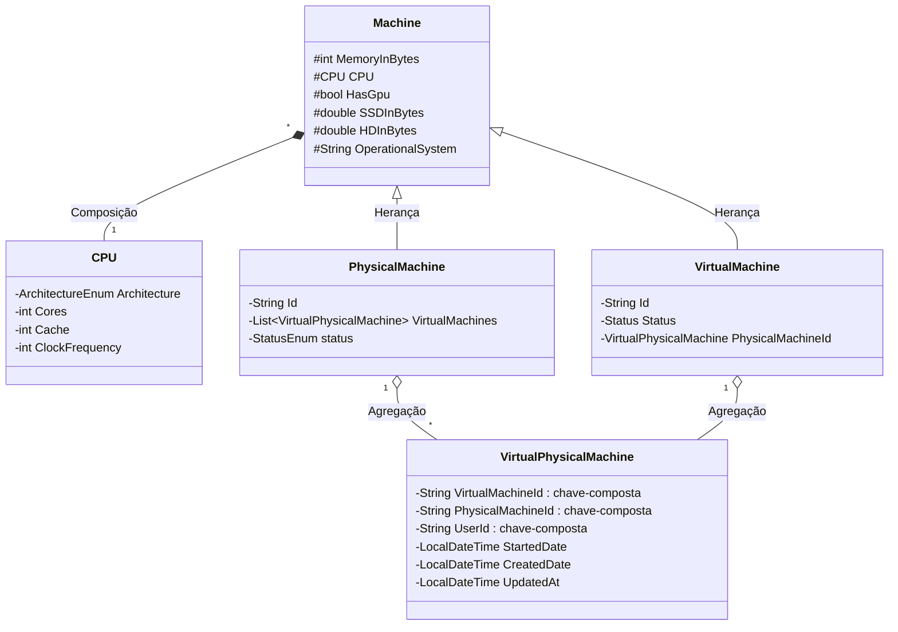

# cs-minicloud
Serviço em Java + JPA + Spring da disciplina TCC00312 - PROJETO DE SOFTWARE da Universidade Federal Fluminense.

UML V2.0



<details>
<summary>Ver UML v1.0 do projeto</summary>

```
classDiagram   
 
    class CPU {
       -ArchitectureEnum Architecture
       -int Cores
       -int Cache 
       -int ClockFrequency
    }

    class Machine{
      #int MemoryInBytes
      #CPU CPU
      #bool HasGpu
      #double SSDInBytes
      #double HDInBytes
      #String OperationalSystem
    }

    Machine "*" *-- "1" CPU : Composição

    class PhysicalMachine {
        -String Id
        -List~VirtualMachine~ VirtualMachines
        -Address Address
        -StatusEnum status
    }

    class VirtualMachine {
        -String Id
        -LocalDateTime StartedDate
        -LocalDateTime CreatedDate
        -LocalDateTime UpdatedAt
        -Status Status
        -String UserId
        -String PhysicalMachineId
    }

    class Address{
        -String Logradouro
        -String Numero
        -String Bairro
        -String CEP
        -String Complemento
        -int NumeroDaSalaDeServidor
        -int Rack
        -String Label
    }
            
    Machine <|-- PhysicalMachine : Herança
    Machine <|-- VirtualMachine : Herança
    PhysicalMachine "1" o-- "*" VirtualMachine  : Agregação
    PhysicalMachine "1" *-- "1" Address : Composição
```
</details>


